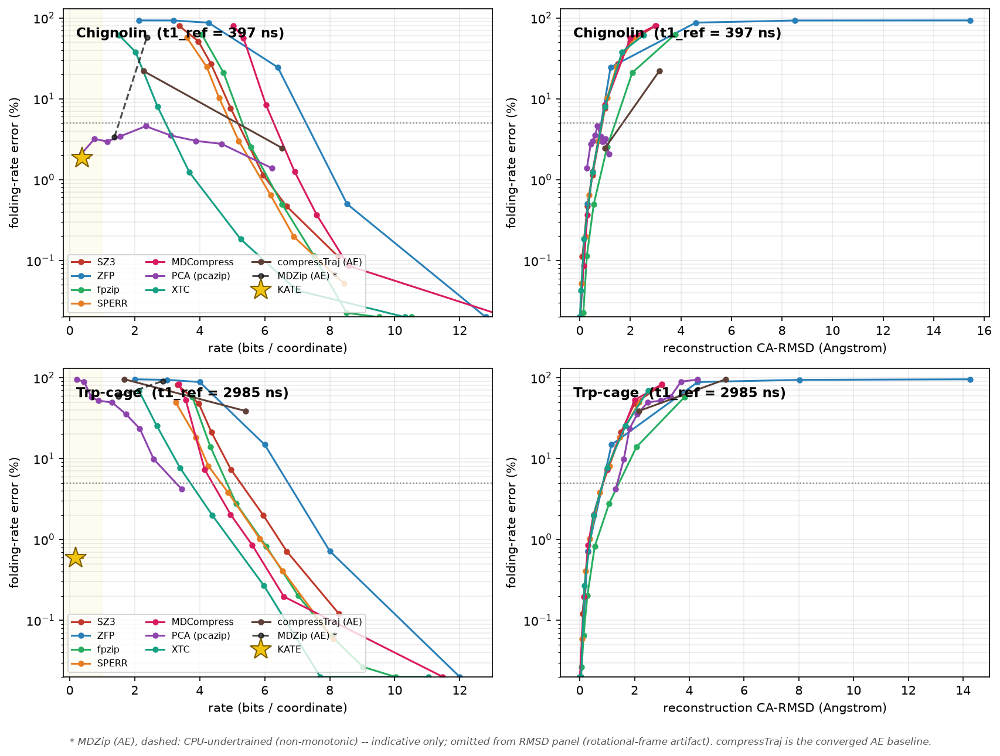

<div align="center">

<pre>
██╗  ██╗ █████╗ ████████╗███████╗
██║ ██╔╝██╔══██╗╚══██╔══╝██╔════╝
█████╔╝ ███████║   ██║   █████╗  
██╔═██╗ ██╔══██║   ██║   ██╔══╝  
██║  ██╗██║  ██║   ██║   ███████╗
╚═╝  ╚═╝╚═╝  ╚═╝   ╚═╝   ╚══════╝
</pre>

### Kinetic-Aware Trajectory Encoder

Kinetics-preserving compression of molecular dynamics trajectories, with a path-space fidelity bound that covers rates and timescales, not only the static ensemble

<br>

[](https://github.com/anandojha/kate/actions/workflows/ci.yml)
[](https://codecov.io/gh/anandojha/kate)
[](https://www.codefactor.io/repository/github/anandojha/kate)

[](https://www.python.org/downloads/)
[](https://pytorch.org/)
[](https://deeptime-ml.github.io/)

[](https://opensource.org/licenses/MIT)
[](https://github.com/psf/black)
[](https://github.com/anandojha/kate/network/updates)
[](https://github.com/anandojha/kate)

</div>

<div align="center">



</div>

---

## Overview

KATE compresses an MD trajectory with its kinetics as the fidelity target. General-purpose compressors bound coordinate error, and ensemble-preserving methods bound static averages, but neither covers the dynamics: two trajectories with identical stationary distributions can have arbitrarily different rates. KATE couples a normalizing-flow density model, a Markov state model, and entropy coding, and carries a path-distribution bound, `KL(path) = ensemble term + transition term`, so that the slow timescales and mean first-passage times are preserved where coordinate- and ensemble-bounded compressors collapse them. The compressed artifact is analysis-native: the file is the kinetic model.

## Method

Configurations are aligned by the Kabsch algorithm and reduced to a small set of slow collective variables by TICA. A normalizing flow learns an exact-likelihood density over the collective variables, so a divergence measured in its Gaussian base space transfers to configuration space without a Gaussian-reference assumption. A representative frame subset is retained by information-gain (farthest-point) selection and reweighted to the stationary measure, and the kept latents are entropy-coded losslessly against the base density. The dynamics are retained separately as a reversible-MLE Markov state model estimated on the collective variables. The path-distribution KL factorizes into an ensemble term, bounded through Pinsker for static observables, and a transition term for the kinetics; together they certify the fidelity of kinetic observables.

## Features

### Compression

- **Kinetics-first objective.** The declared fidelity target is the dynamics (implied timescales, MFPTs, k<sub>on</sub>/k<sub>off</sub>), not coordinate RMSD or static averages.
- **Analysis-native artifact.** The `.kate` file stores the flow, the coded frames, and the MSM, so it is the kinetic model rather than a blob to be re-analyzed.
- **Path-space fidelity bound.** `KL(path) = ensemble + transition` term, with the ensemble term bounded through the Pinsker inequality.

### Model

- **Exact-likelihood normalizing flow.** From-scratch RealNVP and rational-quadratic spline coupling flows, invertible by construction, so kept frames reconstruct exactly and the density is exact.
- **Reweighted frame selection.** Farthest-point coverage in base space, with stationary Voronoi-cell weights so ensemble averages over the kept subset are unbiased.
- **Witten-Neal-Cleary entropy coder.** A textbook arithmetic coder codes the kept latents against the flow base density and the discrete-state sequence against the MSM.

### Kinetics and rigor

- **Reversible-MLE MSM.** Reported and certified kinetics route through the [deeptime](https://github.com/deeptime-ml/deeptime) reversible maximum-likelihood estimator; the artifact records which estimator produced the numbers.
- **Rates and pathways.** MFPTs and PCCA+ metastable coarse-graining, so k<sub>on</sub>/k<sub>off</sub> ~ 1/MFPT is reported in the language the field cites.
- **MSM validation.** Implied-timescale lag scan, Chapman-Kolmogorov test, and block-bootstrap confidence intervals.
- **Invariant featurization.** Rotation- and translation-invariant contact distances remove the spurious rigid-body slow mode that raw Cartesian TICA introduces.

## Relation to prior work

The path-space bound KATE uses is established prior art; the contribution is adopting it as a compressor's fidelity objective and the measured contrast, not a new theorem and not any single component.

- Pantazis and Katsoulakis, J. Chem. Phys. 138, 054115 (2013), arXiv:1210.7264 - relative-entropy-rate path-space sensitivity for stationary stochastic dynamics.
- Dupuis, Katsoulakis, Pantazis and Plechac, SIAM/ASA JUQ (2016), arXiv:1503.05136 - goal-oriented path-space information bounds, tighter than plain relative-entropy-rate and Pinsker.
- Birrell, Katsoulakis and Rey-Bellet, arXiv:1906.09282 (2019) - path-space bounds for hitting times and mean first-passage times specifically.

KATE's stationary-plus-transition factorization is the discrete-time finite-state Markov specialization of that object.

## Installation

**From source (recommended):**

```bash
git clone https://github.com/anandojha/kate.git
cd kate
bash install_kate.sh
```

**pip:**

```bash
pip install git+https://github.com/anandojha/kate.git                       # core (compress, decompress, bound)
pip install "kate[kinetics] @ git+https://github.com/anandojha/kate.git"    # + deeptime (analyze, benchmark)
```

**conda:**

```bash
conda create -n kate python=3.11 -y
conda activate kate
pip install -e ".[kinetics,test]"
```

## Testing

```bash
python -m pytest tests/
python -m pytest tests/ -v --cov=kate
```

## Quick start

```bash
conda activate kate
python examples/demo_kate.py                       # end-to-end on a synthetic trajectory
kate compress topology.pdb traj.dcd -o run.kate    # compress with kinetics as the target
kate analyze run.kate --mfpt 2 --bootstrap         # timescales, MFPTs, bootstrap CIs
kate bound run.kate ref.kate                        # path-space fidelity bound vs a reference
```

## Examples

See [`examples/`](examples/) for runnable demonstrations.

```
examples/
├── demo_pathbound.py         The path-space bound (ensemble term ~0, transition term large)
├── demo_kinetic_codec.py     The classical MSM-as-entropy-coder path
├── demo_kate.py              End-to-end flow-based codec on a synthetic trajectory
└── demo_bound_loss.py        The differentiable path-bound loss
```

## Requirements

- Python 3.9+
- NumPy
- SciPy
- scikit-learn
- PyTorch
- MDTraj
- deeptime (kinetics extra)
- Matplotlib (kinetics extra)

## License

MIT

## Citation

When using KATE, please cite:

> Ojha et al. KATE: kinetics-preserving compression of molecular dynamics trajectories with a path-space fidelity bound (2026).
